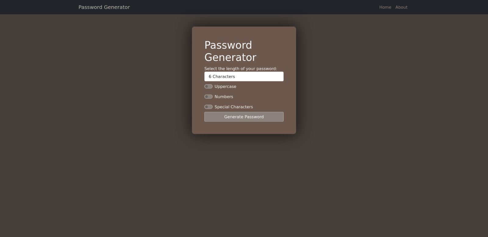
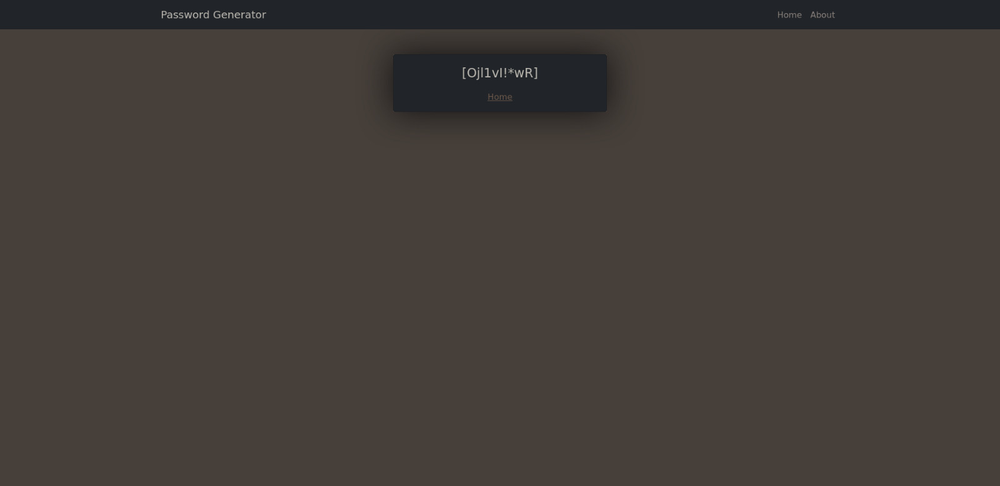

# Django Password Generator
Django project to create random passwords, you can use filters such as uppercase, numbers and special characters, you can also modify the lenght of the password.

## :camera: Images

## Installation
1. First clone the repo `git clone https://github.com/zvdy/Password_Generator.git`
2. Open a new terminal and move to the cloned repo `cd Password_Generator`
3. Install the requirements using pip `pip install -r requirements.txt`
4. Deploy the app server with `python manage.py runserver`
5. If you feel like modifying the code and re-deploying the app make sure to run `python manage.py migrate` before runing the server again.
